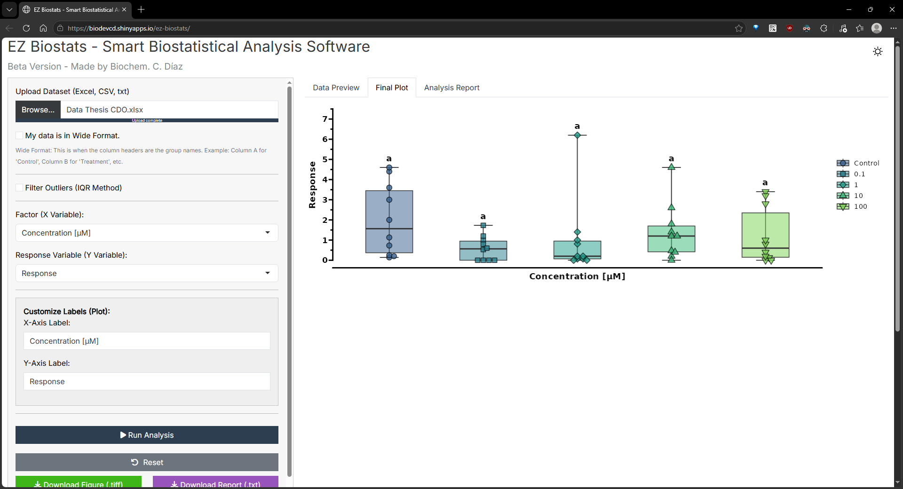

# EZ Biostats: Online Statistical Analysis and Data Visualization Tool 🧬
### Automated Biostatistics & Publication-Ready Graphics for Researchers

**EZ Biostats** is an open-source web tool designed for scientists, biochemists, and life science researchers. It provides robust statistical results—like **ANOVA** and **T-Tests**—without the steep learning curve of R or expensive software.

Go from raw data to a comprehensive statistical report and high-quality visualization in seconds.

[**🚀 Launch Live App**](https://biodevcd.shinyapps.io/ez-biostats/)

---

## ⚡ The Problem The Tool Solves
Laboratory data analysis is often slow, repetitive, and prone to formatting errors. EZ Biostats removes the friction between data collection and result interpretation.

* **Zero Installation:** Works entirely in your web browser.
* **One-Click Workflow:** Upload your file and get instant results.
* **Professional Graphics:** Automatically generates "Jitter plots" with error bars, the gold standard for modern scientific publishing.
* **Methodological Guidance:** Not just a calculator; it's designed to choose the right test based on your data's distribution.

---

## ✨ Automated Statistics & Data Visualization Features
* **Automated Hypothesis Testing:** Perform **One-Way ANOVA** and **Student's T-Test** online with professional accuracy.
* **Scientific Jitter Plots:** Generate high-resolution plots with error bars, following international publishing standards (Nature, Science, Cell).
* **Assumption Testing:** Built-in checks for **Normality (Shapiro-Wilk)** and **Homoscedasticity (Levene's Test)**.
* **Bilingual Interface:** Full support for both **English and Spanish** users.
* **Inclusive Design:** 
    * **Colorblind-Friendly:** Uses the **Viridis color palette**, ensuring plots are accessible to everyone and look great in grayscale prints.
    * **Dark Mode:** Easy on the eyes for long laboratory sessions.

---

## 🛠️ How It Works
1.  **Upload:** Drop your `.csv` or `.xlsx` file.
2.  **Select:** Choose your dependent and independent variables.
3.  **Analyze:** The tool runs the appropriate statistical model and generates the report.
4.  **Export:** Download your results and publication-ready plots instantly.

---

## 💡 Why EZ Biostats?
Many researchers look for a **free GraphPad Prism alternative** that doesn't sacrifice statistical rigor. EZ Biostats provides:
* **Cost-Free Analysis:** No subscriptions or expensive licenses.
* **Prism-Style Visualization:** Get the same high-quality Jitter plots and error bars expected in top-tier journals.
* **R-Powered Accuracy:** While Prism is a black box for some, EZ Biostats is transparent and built on the most trusted statistical engine in the world.

---

## 🔬 Scientific Foundation
Built on the **R statistical engine**, EZ Biostats leverages industry-standard libraries used in high-impact research. My goal is to streamline data analysis for life sciences, ensuring that technical hurdles don't stand in the way of scientific discovery.

---

## ☕ Support my Work
If EZ Biostats has saved you time or helped with your research, consider supporting its development:

*   **From Chile 🇨🇱:** [Buy me a coffee via MercadoPago](https://link.mercadopago.cl/ezbiostatscl)
*   **Rest of the World 🌎:** [Buy me a coffee on Ko-fi](https://ko-fi.com/ezbiostats)

---

## 💬 Feedback & Contact
This tool is currently in its stable, semi-functional version. I am actively looking for technical and scientific feedback to improve its robustness.

*   **Found a bug?** Open an [Issue](https://github.com/BioDevCD/ez-biostats/issues)
*   **Have a suggestion?** Feel free to reach out via [Reddit](https://www.reddit.com/user/Fresh-Wolf-7711/) or email me at [`cadiazop@gmail.com`](cadiazop@gmail.com).
*   **Want to contribute?** Feedback on statistical logic and UI/UX is more than welcome.

---
*Developed with ☕ by [C. Díaz / BioDevCD](https://github.com/BioDevCD)*
